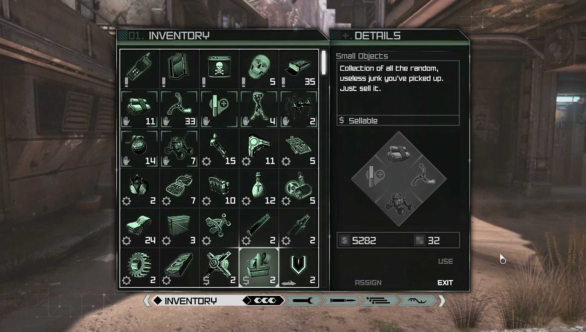

# LINKS

## "Video Game Interfaces"

### Are.na Channel: 
[https://www.are.na/ali-salifov/video-game-interfaces-x9glzuoklq](https://www.are.na/ali-salifov/video-game-interfaces-x9glzuoklq)

### Authors: 

Original Creator of the Collection - Ali Salifov

[https://www.are.na/ali-salifov/channels](https://www.are.na/ali-salifov/channels)

Collaborator and Developer of the Collection - Sophia Bae

[https://www.are.na/sophia-bae-zsvqiaw7cdm/channels](https://www.are.na/sophia-bae-zsvqiaw7cdm/channels)

---

## Overview

This project uses Are.na's API as a Content Management System (CMS) to dynamically render and organize a collection between Sophia Bae and Ali Salifov, exploring **video game interfaces**. The channel explores elements like HUD systems, inventory screens, menus, and surreal digital game graphics.

Instead of presenting the collection as a typical gallery, I reimagined it as a **playable inventory system**, inspired by the inventory screen from the video game *RAGE* (2011).

The interface behaves like a game system:

* Blocks act as inventory items
* Users “scan”, or view, the inventory items
* Items can be “equipped” (navigated to external link) or “dropped” (reset to channel information view)
* Media types function as UI categories
* HUD counters track the user's interactions

---

## Concept & Inspiration

### RAGE Inventory Screen

The structure and interaction model of this project were heavily inspired by the inventory screen from the video game RAGE (2011).

What specifically influenced my design:

* Grid-based object layout
* Strong left/right panel hierarchy on desktop (Inventory + Details)
* Clear category labeling (“INVENTORY” / “DETAILS”)
* High-contrast HUD typography
* Subtle glow and neon accent colors
* Quantified item counters
* Focus/Hover-based inspection interactions on blocks

Rather than copying the visual style directly, I translated the logic of the interface into a web system that was applicable to the channel's concept:

* Blocks become inventory objects
* Selecting a block activates a detail state
* Metadata is formatted like a HUD stat panel
* Counters track interaction (“scanned”)
* Filtering mimics category toggles

My goal was not to recreate the screen exactly, but to reinterpret its interaction structure within a responsive web environment for this project.

---

## How It Works

### 1. Are.na as CMS

All content is fetched dynamically using the Are.na API, through arena.js.

There are no local media assets in the repo.
If the channel updates, the site updates as well.

---

### 2. Media Type System

A helper function translates Are.na block types into simplified labels:

* IMG
* TXT
* URL
* MP3
* MP4

This allows:

* Filtering
* Consistent labeling (3-character labels for consistency)
* Conditional preview rendering

**AI Attribution:**
ChatGPT suggested creating a helper function to normalize block types for filtering and display logic. (Please see an explanation of my own understanding and specific help from LLM in the arena.js file.)

---

### 3. Dynamic Rendering

Blocks are rendered as square inventory tiles.

Each tile:

* Uses a fallback image ladder (to prevent missing thumbnails as some blocks in the channel do not have images)
* Stores block data in a lookup object
* Includes data attributes for filtering and selection

**AI Attribution:**
ChatGPT suggested the fallback image logic and storing block data in an object for efficient detail rendering. (Please see an explanation of my own understanding and specific help from LLM in the arena.js file.)

---

### 4. Detail Panel (State-Based UI)

The right panel switches between:

* Channel info (default state)
* Block detail (selected state)

When a block is selected:

* Media preview renders conditionally based on what specific block is chosen
* Metadata is formatted and displayed
* The index is padded for visual consistency
* Scroll resets to the top

**AI Attribution:**
Claude suggested structuring this as a “state-driven UI” rather than a static panel. (Please see an explanation of my own understanding and specific help from LLM in the arena.js file.)

---

### 5. Scanned Counter

The site tracks how many unique blocks a user has viewed.

* Uses a `Set` to prevent duplicate counting
* Formats numbers with `padStart()` (001, 002, etc.)

**AI Attribution:**
ChatGPT suggested using a `Set` instead of an `Array` for more efficient lookup. (Please see an explanation of my own understanding and specific help from LLM in the arena.js file.)

---

### 6. Filtering System

Filtering uses:

* `aria-pressed` for toggle states
* Centralized filtering logic
* Display updates based on media types that are selected to be on by user

This keeps UI state separate from rendering logic.

**AI Attribution:**
ChatGPT suggested using `aria-pressed` and a shared filter function for cleaner state management. (Please see an explanation of my own understanding and specific help from LLM in the arena.js file.)

---

### 7. Inventory Actions

**Equip**

* Opens the original source in a new tab
* Displays a toast notification to inform user

**Drop**

* Hides the selected block
* Resets detail panel
* Displays confirmation toast to inform user

These interactions reinforce the video game metaphor.

---

## CSS System

### Root Variables

All main colors, spacing, gradients, and glow values are defined in `:root`.

Example categories:

* Panel backgrounds
* Glow intensities
* Gradients
* Drop state colors
* Spacing units

This helps to create a consistent design system and avoid manually hardcoded values, as much as possible.

---

### Responsive Layout

The layout adapts fluidly using modern media queries:

* `@media (width < 360px)` — Default / Mobile (not explicitly defined in CSS)
* `@media (360px <= width <= 780px)` — Mobile
* `@media (780px <= width <= 1280px)` — Tablet
* `@media (width > 1280px)` — Desktop

Responsive behavior:

* Mobile uses a sliding bottom drawer for details
* Desktop uses a split inventory/detail layout
* Grid shifts from 3 to 5 columns
* Font size scales at the root

---

## Motion & Atmosphere

Animations include:

* Starfield parallax background
* Scanline overlay pulse
* Glitch effects
* Floating tiles
* Hero screen flash transition

The starfield effect was adapted from a CodePen example and rewritten in pure CSS using layered radial gradients, due to not being able to fully comprehend and pply original code.

**AI Attribution:**
Claude suggested refining animation timing and structuring staggered `setTimeout()` transitions for the hero screen. (Please see an explanation of my own understanding and specific help from LLM in the arena.js file.)

---

## Technical Approach

This project emphasizes these key points:

* Semantic HTML structure
* CSS variables for consistent system styling
* Event delegation for dynamic elements
* Defensive guard clauses
* Separation of structure, style, and behavior through different file types
* API-based content rendering
* Concept-driven interactivity

---

## Reflection

This project pushed me to let the **concept itself drive the organizing principle for the interface**.

Instead of building a neutral viewer for the collection as I initially started out with, I eventually designed a system that behaves like the interfaces being collected within the channel that I worked with.
